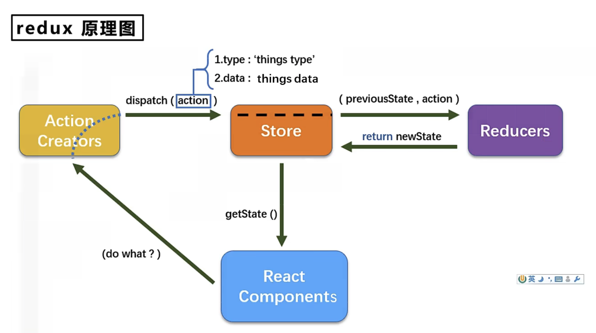
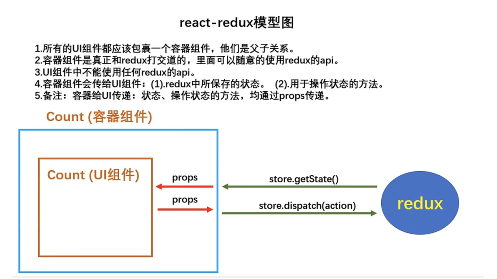

运行： npm start
打包： npm run build

笔记：

1. 安装这个扩展： ES7 +react/redux 
    rcc: 创建一个类组件
    rfc: 创建一个函数组件
    
2. 组件化编码流程：
    （1）拆分组件：拆分界面，抽取组件
    （2）实现静态组件：使用组件实现静态页面
    （3）实现动态组件：
        a.动态显示初始化数据:数据类型、数据名称、保存在哪个组件
        b.交互（从绑定事件监听开始）
    
3. 使用uuid或者nanoid库，生成全球唯一的id,不重复。安装：npm i nanoid

4. todoList案例学习：
    （1）状态在哪里，操作状态的方法就在哪里。
    （2）两个子组件，一个需要展示todo列表，一个要增加todo列表，那么todo列表定义在他们的父组件的state中(即状态提升)。
    （3）父组件向子传递，用props。
    （4）若子组件要修改父组件的state中的值，即子向父传递，步骤：首先，父向子传递一个props,是一个函数；然后在子组件中需要修改的方法中，调用父给的这个props函数，并传参，参数是要改的内容。父组件里要定义这个props函数，并且是一个高阶函数（即return一个函数）。
    （5）如果孙组件要修改祖组件的state,也要通过传父，再传父。
    （6）注意defaultChecked和checked的区别。defaultChecked只在第一次进来时调用，后面更新值不变。
    
5. 安装prop-types库来限制props. 安装： npm i prop-types

6. 常用的ajax库：
    （1）jquery:比较重，不建议。
    （2）axios:轻量级，建议使用。特点：
        a).封装XmlHttpRequest对象的ajax
        b). promise 风格
        c).可以用在浏览器端和node服务器端。
    
7. react脚手架配置代理：
    （1）在package.json中追加配置： "proxy":"http://localhost:5000"
        特点：
        a).优点：配置简单，前端请求资源时可以不加任何前缀。
        b).缺点：不能配置多个代理。
        c).工作方式：上述配置，当请求了3000不存在的资源时，会去把请求转发给5000.
    （2）配置文件: src/setupProxy.js 
        a).优点：可以配置多个代理，可以灵活的控制请求是否走代理。
        b).缺点：配置繁琐，前端请求资源时必须加前缀。
    
8. 连续解构赋值 + 重命名。
    let obj={a:{b:{c:1}}}
    const {a: {b: {c:data}}} = obj
    console.log(data);  // 1
    
9. github案例 -- github请求地址：https://api.github.com/search/users?q=xxx  这个接口服务端cors配置了，所以没有跨域问题. 
    产品思维：考虑第一次页面载入显示状态、请求数据过程的loading状态、 返回错误的处理状态
    
10. 父子通信传递：
    父向子传递： 使用props
    子向父传递： 父先向子通过props传递一个函数，子在合适的时机调用这个函数（传参数），来实现子向父传递。
    
11. 消息订阅-发布机制 : 发布（publish）、订阅（subscribe）
    工具库：pubsub-js
    想要使用数据的组件，在componentDidMount钩子中去订阅（subscribe）消息；在componentWillUnMount钩子中取消订阅；
    想要发送数据的组件里，使用发布(publish)消息。
    适用于任意组件之间通信。
    
12. ajax请求： 
    (1) xhr(xmlHttpRequest) 、jquery(该库是对xhr的封装)、axios(该库是对xhr的封装);
    (2) fetch（关注分离的设计思想），这个是window上的一个方法。不是第三方库，而且是promise风格的。 老版浏览器可能不支持。
    
13. SPA： 
    a.单页面应用 
    b.整个页面只有一个页面 
    c.点击页面中的链接不会刷新，只做局部刷新。
    d. 数据都需要通过ajax来请求，并在前端异步展示。
    
14. 路由： key--value
        前端路由： path -- component
        后端路由： path -- function
        路由原理：H5的history 
        router模式：browserRouter、hashRouter

15. react-router-dom: react在web用的库。需自己安装
    路由的基本使用：
    a. 明确好界面中的导航区，展示区；
    b. 导航区的a标签改为<Link>标签：
        <Link to="/xxx">Demo</Link>
    c. 展示区写Route标签进行路由匹配：
        <Route path="/xxx" component={Demo}/>
        注意新版本的Route写法不同
        <Route path="/xxx" element={<Demo/>}/>
    d. App的最外侧包裹一个<BrowserRouter>或<HashRouter>。
    
16. 一般组件： 通常写在components文件夹中，可以接收正常的props;
    路由组件：是在路由匹配后渲染的组件，通常写在pages文件夹中，可以接收到3个固定参数有：history、location、match。
    
17. NavLink与封装NavLink:
    a. NavLink可以实现路由链接的高亮，通过activeClassName指定样式名；
    b. 标签体内容是一个特殊的标签属性；
    c. 通过this.props.children可以获取标签体内容。
    
18. Switch的使用：
    a. 通常情况下，path和component是一一对应的关系；
    b. Switch可以提高路由匹配效率（单一匹配）。
    
19. 路由的严格匹配与模糊匹配：
    a. 默认使用的是模糊匹配，（输入的路径必须包含要匹配的路径，且顺序要一致);
    b. 开启严格模式，关键字 exact;
    c. 严格模式不能随便开启，需要再开。有时候开启严格模式会导致无法匹配二级路由。
    
20. redircet（重定向）的使用： 一般下在所有路由注册的最下方，当所有路由都无法匹配时，跳转到redirect所指定的地址。
    <Redirect to="/about"/>
    
21. 嵌套路由：
    a. 注册子路由需要写上父路由的path;
    b. 路由的匹配是按照注册路由的顺序进行的。
    
22. 递参数
    1.params参数
        路由链接（携带参数）：<Link to='/demo/test/tom/18'}>详情</Link>
        注册路由（声明接收）：<Route path="/demo/test/:name/:age" component={Test}/>
        接收参数：this.props.match.params
    2.search参数
        路由链接（携带参数）：<Link to='/demo/test?name=tom&age=18'}>详th</Link>
        注册路由〈无需声明，正常注册即可）：<Route path="/demo/test" component={Test}／>
        接收参数：this.props.location.search
        备注：获取到的search是ur1encodedG码字符串，需要借助querystring解析
    3.state参数
        路由链接〈携带参数）：<Link to={{path：'/demo/test',state：{name:'tom',age:18}}}>详情</Link>
        注册路由（尢需声明，正常注册即可）：<Route path="/demo/test" component={Test}/>
        接收参数：this.props.location.state
        备注：刷新也可以保留住参数
    
23. 编程式路由导航： 借助this.props.history对象上的api对操作路由跳转、前进、后退。
    this.props.history.push()
    this.props.history.replace()
    this.props.history.goForward()
    this.props.history.goBack()
    this.props.history.go(n)
    
24. withRouter是将一般组件加工成路由组件，使一般组件身上也可以有路由组件所有的特性，即history、location、match。

25. antd的样式按需加载参考这个学习： https://www.bilibili.com/video/BV1wy4y1D7JT?p=95&      spm_id_from=pageDriver

26. antd自定义主题参考这个学习： https://www.bilibili.com/video/BV1wy4y1D7JT?p=96

27. redux:集中式管理多个组件等共享状态。
     
    redux是民间发布的一个库，可以与react,vue,angular配合使用。
    安装： npm i redux
    学到3个api: 
        (1) store.getState() 获取store中的状态；
        (2) store.dispatch({type,data})  分发一个action,包含两个参数：type,data
        (3) store.subscribe() 检测store中状态有变化，用来重新让组件render
    
28. react-redux: 是官方facebook出品的专门用于react的状态管理库。

    
    
    安装： npm i react-redux
    基本使用：
        （1）明确两个概念：
            1）UI组件：不能使用redux的任何api,只负责页面的呈现，交互。
            2）容器组件：负责和redux通信，将结果交给UI组件。
        （2）如何创建一个容器组件--靠react-redux的connet函数
            connect(mapStateToProps,mapDispatchToProps)(UI组件)
                -- mapStateToProps：映射状态，返回值是一个对象
                -- mapDispatchToProps:映射操作状态的方法，返回的是一个对象
        （3）备注1：容器组件中的store是靠props传入的，而不是直接import 引入的。
        （4）备注2: mapDispatchToProps也可以是一个对象。
    
29. react-redux案例优化：
    （1）容器组件和UI组件整合在一个文件中；
    （2）无需自己给容器组件传递store,可以使用Provider包裹<App/> 来传递store;
     (3)不用检测state的变化来render组件，react-redux会自动监测；
    （4）mapDispatchToProps可以简写成一个对象。
30. redux --- 使用combineReducers来组合多个reducer
## react扩展
1. setState()更新状态的2种写法
   （1）对象方式: setState(stateChange, [callback]) 
    stateChange为对象;
    callback是可选的回调函数, 在状态更新且界面更新后才执行.
   （2）函数方式: setState(updater, [callback])
    updater为返回stateChange对象的函数: (state, props) => stateChange 接收的state和props被保证为最新的;
    callback是可选的回调函数, 在状态更新且界面更新后才执行.
   总结:  对象方式是函数方式的简写方式，
      如果新状态不依赖于原状态 ===> 使用对象方式 
      如果新状态依赖于原状态 ===> 使用函数方式 
      如果需要在setState()后获取最新的状态数据, 在第二个callback函数中读取
   
   ```jsx
   // 对象式的
   setState({count:99}, ()=> {
     console.log('这个回调函数里可以得到更新后的state,该回调是可选的')
   })
   // 函数式的
   setState((state,props)=> {
     // 这里的函数式的，参数有两个，state,props
     return {count:state.count+1}
   },[callback])
   ```
   
2. lazy懒加载路由组件

3. 函数式组件：没有自己的this,不能使用state、ref这两大特性。没有生命周期函数。
    react V16.8版本之后推出了hooks,可以使函数式组件使用state及其他的react特性。
    
4. State Hook：
    （1）State Hook使函数组件也可以有state状态，并进行状态数据的读写操作
    
    ```jsx
    //语法
    const [xxx,setXxx] = React.useState(initValue);
    ```
    ​	（2）useState的说明：
    ​    参数：第一次初始化指定的值在内部做缓存；
    ​    返回值： 包含两个元素的数组，第一个为内部当前状态值，第二个为更新状态值的函数。
    ​   （3）setXxx的两种写法：
    ​		 setXxx( newValue): 参数为非函数值，直接指定新的状态值，内部用起覆盖原本的值。
    ​    setXxx(value => newValue):参数为函数，接收原本的状态值，返回新的状态值，内部用起覆盖原来的值。
    
5. Effect Hook:
    （1）Effect Hook可以让你在函数组件中执行副作用（用于模拟类组件中的生命周期钩子）
    （2）React中的副作用操作：
        a. 发ajax请求获取数据
        b. 设置订阅/启动定时器
        c. 手动更改真实Dom
    (3)语法和说明：
    
    ```jsx
    useEffect(()=> {
      // 在此可以执行任何带副作用的操作
      return ()=> {  // 在组件卸载前执行
        // 在此做一些收尾工作，比如 清除定时器/取消订阅等
      }
    },[stateValue]) // 如果指定的是[],回调函数只会在第一次render()后执行
    ```
    （4）可以把useEffect Hook看作如下三个函数的集合：
        componentDidMount()
        componentDidUpdate()
        componentWillUnmount()
6. Ref Hook:
    (1)Ref hook可以在函数组件中存储/查找组件内的标签或任意其他数据
   （2）语法：const refContainer = React.useRef()
    (3)作用：保存标签对象，功能与React.createRef()一样


备注： 尚硅谷 react老师笔记 https://blog.csdn.net/weixin_44987713/article/details/114990470
学到117
